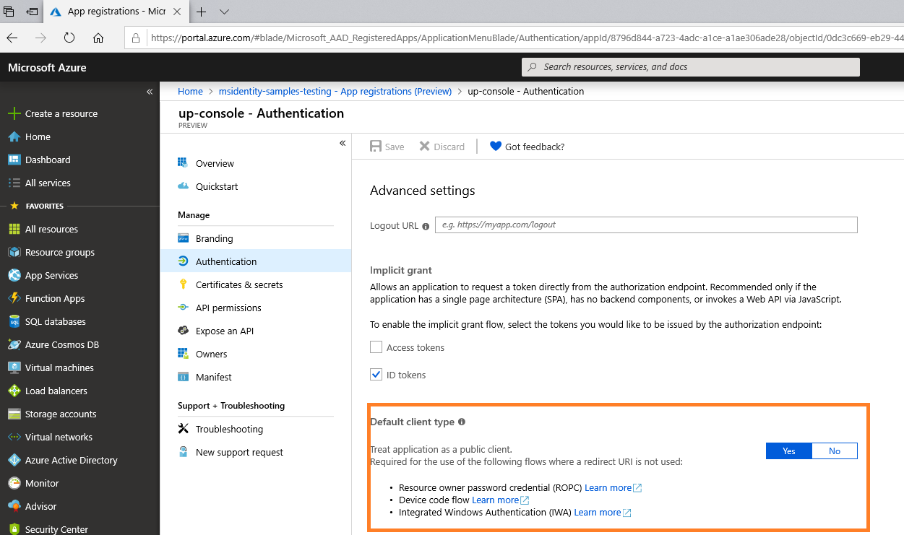
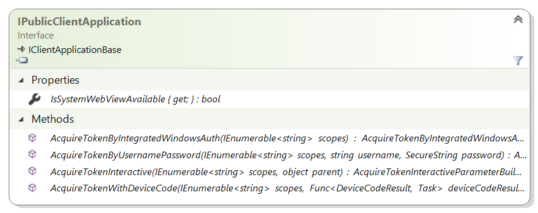
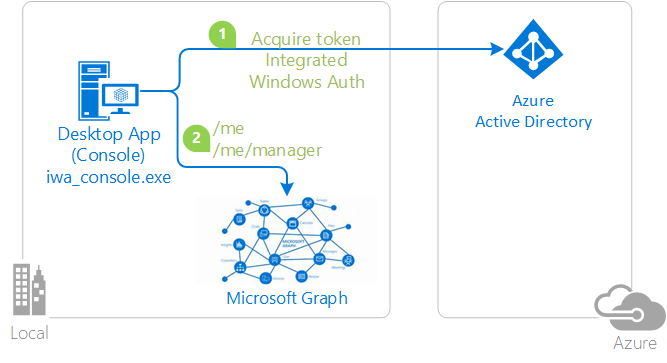

# Using MSAL.NET with Integrated Windows Authentication (IWA)

>[!NOTE]
>Integrated Windows Authentication has been replaced with a more reliable way of getting tokens silently - [WAM](wam.md). WAM can login the current windows user silently. This workflow does not require complex setup and it even works for personal (Microsoft) accounts. Internally, the Windows Broker (WAM) will try several strategies to get a token for the current Windows user, including IWA and redeeming the PRT. This eliminates most of the limitations with IWA.

If your desktop or mobile application runs on Windows and on a machine connected to a Windows domain (AD or AAD joined) it is possible to use the Integrated Windows Authentication (IWA) to acquire a token silently. No UI is required when using the application.

## IWA Constraints

- **Federated** users only, i.e. those created in an Active Directory and backed by Azure Active Directory. Users created directly in Azure AD, without AD backing - **managed** users - cannot use this auth flow. This limitation does not affect the Username/Password flow.
- Does not work for MSA users. For MSA uses try out [WAM](https://github.com/AzureAD/microsoft-authentication-library-for-dotnet/wiki/wam)
- IWA is for apps written for .NET Framework, .NET Core and UWP platforms
- IWA does NOT bypass MFA (multi factor authentication). If MFA is configured, IWA might fail if an MFA challenge is required, because MFA requires user interaction. 
  > This one is tricky. IWA is non-interactive, but 2FA requires user interactivity. You do not control when the identity provider requests 2FA to be performed, the tenant admin does. From our observations, 2FA is required when you login from a different country, when not connected via VPN to a corporate network, and sometimes even when connected via VPN. Don’t expect a deterministic set of rules, Azure Active Directory uses AI to continuously learn if 2FA is required. You should fallback to a [user prompt](./acquiring-tokens-interactively.md) if IWA fails

- The authority passed in the `PublicClientApplicationBuilder` needs to be:
  - tenanted (of the form `https://login.microsoftonline.com/{tenant}/` where `tenant` is either the guid representing the tenant ID or a domain associated with the tenant.
  - for any work and school accounts (`https://login.microsoftonline.com/organizations/`)

  > Microsoft personal accounts are not supported (you cannot use /common or /consumers tenants)

- Because Integrated Windows Authentication is a silent flow:
  - the user of your application must have previously consented to use the application 
  - or the tenant admin must have previously consented to all users in the tenant to use the application.
  - This means that:
    - either you as a developer have pressed the **Grant** button on the Azure portal for yourself, 
    - or a tenant admin has pressed the **Grant/revoke admin consent for {tenant domain}** button in the **API permissions** tab of the registration for the application (See [Add permissions to access web APIs](/azure/active-directory/develop/quickstart-configure-app-access-web-apis#add-permissions-to-access-web-apis))
    - or you have provided a way for users to consent to the application (See [Requesting individual user consent](/azure/active-directory/develop/v2-permissions-and-consent#requesting-individual-user-consent))
    - or you have provided a way for the tenant admin to consent for the application (See [admin consent](/azure/active-directory/develop/v2-permissions-and-consent#requesting-consent-for-an-entire-tenant))

- This flow is enabled for .net desktop, .net core and Windows Universal Apps.
  
For more details on consent see [v2.0 permissions and consent](/azure/active-directory/develop/v2-permissions-and-consent)

## How to use it?

### Application registration

During the **[App registration](https://go.microsoft.com/fwlink/?linkid=2083908)** , in the **Authentication** section for your application:

- You don't need to provide a Reply URI
- You need to choose **Yes** as the answer to the question **Treat application as a public client** (in the **Default client type** paragraph)

  

### Code

<xref:Microsoft.Identity.Client.IPublicClientApplication> contains a method called `AcquireTokenByIntegratedWindowsAuth`

[](/dotnet/api/microsoft.identity.client.publicclientapplication.acquiretokenbyintegratedwindowsauth)

```csharp
AcquireTokenByIntegratedWindowsAuth(IEnumerable<string> scopes)
```

You should normally use only one parameter (`scopes`). However depending on the way your Windows administrator has setup the policies, it can be possible that applications on your windows machine are not allowed to lookup the logged-in user. In that case, use a second method `.WithUsername()` and pass in the username of the logged in user as a UPN format - `joe@contoso.com`.

The following sample presents the most current case, with explanations of the kind of exceptions you can get, and their mitigation.

```csharp
static async Task GetATokenForGraph()
{
 string authority = "https://login.microsoftonline.com/contoso.com";
 string[] scopes = new string[] { "user.read" };
 IPublicClientApplication app = PublicClientApplicationBuilder
      .Create(clientId)
      .WithAuthority(authority)
      .Build();

 var accounts = await app.GetAccountsAsync();

 AuthenticationResult result = null;
 if (accounts.Any())
 {
  result = await app.AcquireTokenSilent(scopes, accounts.FirstOrDefault())
      .ExecuteAsync();
 }
 else
 {
  try
  {
   result = await app.AcquireTokenByIntegratedWindowsAuth(scopes)
      .ExecuteAsync(CancellationToken.None);
  }
  catch (MsalUiRequiredException ex)
  {
   // MsalUiRequiredException: AADSTS65001: The user or administrator has not consented to use the application 
   // with ID '{appId}' named '{appName}'.Send an interactive authorization request for this user and resource.

   // you need to get user consent first. This can be done, if you are not using .NET Core (which does not have any Web UI)
   // by doing (once only) an AcquireToken interactive.

   // If you are using .NET core or don't want to do an AcquireTokenInteractive, you might want to suggest the user to navigate
   // to a URL to consent: https://login.microsoftonline.com/common/oauth2/v2.0/authorize?client_id={clientId}&response_type=code&scope=user.read

   // AADSTS50079: The user is required to use multi-factor authentication.
   // There is no mitigation - if MFA is configured for your tenant and Azure AD decides to enforce it, 
   // you need to fallback to an interactive flows such as AcquireTokenInteractive or AcquireTokenByDeviceCode
   }
   catch (MsalServiceException ex)
   {
    // Kind of errors you could have (in ex.Message)

    // MsalServiceException: AADSTS90010: The grant type is not supported over the /common or /consumers endpoints. Please use the /organizations or tenant-specific endpoint.
    // you used common.
    // Mitigation: as explained in the message from Azure AD, the authoriy needs to be tenanted or otherwise organizations

    // MsalServiceException: AADSTS70002: The request body must contain the following parameter: 'client_secret or client_assertion'.
    // Explanation: this can happen if your application was not registered as a public client application in Azure AD 
    // Mitigation: in the Azure portal, edit the manifest for your application and set the `allowPublicClient` to `true` 
   }
   catch (MsalClientException ex)
   {
      // Error Code: unknown_user Message: Could not identify logged in user
      // Explanation: the library was unable to query the current Windows logged-in user or this user is not AD or Azure AD
      // joined (work-place joined users are not supported). 

      // Mitigation 1: on UWP, check that the application has the following capabilities: Enterprise Authentication, 
      // Private Networks (Client and Server), User Account Information

      // Mitigation 2: Implement your own logic to fetch the username (e.g. john@contoso.com) and use the 
      // AcquireTokenByIntegratedWindowsAuth form that takes in the username

      // Error Code: integrated_windows_auth_not_supported_managed_user
      // Explanation: This method relies on an a protocol exposed by Active Directory (AD). If a user was created in Azure 
      // Active Directory without AD backing ("managed" user), this method will fail. Users created in AD and backed by 
      // Azure AD ("federated" users) can benefit from this non-interactive method of authentication.
      // Mitigation: Use interactive authentication
   }
 }


 Console.WriteLine(result.Account.Username);
}
```

Note: if you encounter the following error:

_"Microsoft.Identity.Client.MsalClientException: Failed to get user name ---> System.ComponentModel.Win32Exception: No mapping between account names and security IDs was done"_

It means that you may be singed into the device with a local computer account as opposed to an Active Directory(AD) account. Please ensure that the device is added to the domain and that the currently signed in user backed by AD. It is not enough to have a computer joined to a domain alone as local accounts on the device wont be able to access your AD credentials.

## Sample illustrating acquiring tokens through Integrated Windows Authentication with MSAL.NET

Sample | Platform | Description
------ | -------- | -----------
[active-directory-dotnet-iwa-v2](https://github.com/Azure-Samples/active-directory-dotnet-iwa-v2) | Console (.NET) | .NET Core console application letting the user signed-in in Windows, acquire, with the Azure AD v2.0 endpoint, a token for the Microsoft Graph 

## Additional information

In case you want to learn more about Integrated Windows Authentication:

- How this was done with the V1 endpoint: [AcquireTokenSilent using Integrated authentication on Windows (Kerberos) in ADAL.NET](https://github.com/AzureAD/azure-activedirectory-library-for-dotnet/wiki/AcquireTokenSilentAsync-using-Integrated-authentication-on-Windows-(Kerberos))

## Troubleshooting

If you encounter the error code "parsing_wstrust_response_failed" It may be due to a number of configuration issues in the ADFS environment.

Some of those issues include:

- An account is not being available to perform IWA
- An IWA policy is preventing auto-IWA authentication
- Proxy or configuration issues prevent NTLM protocol (usually the case for 401 [Negotiate](https://www.ietf.org/rfc/rfc4559.txt)/NTLM challenge presented by the endpoint for Windows authentication. You may be able to try using your own [HttpClient](https://github.com/AzureAD/microsoft-authentication-library-for-dotnet/wiki/HttpClient) or changing the current version of .NET to work around this issue).
- In case the Error Message is "Object reference not set to an instance of an object." [enable MSAL logging](/azure/active-directory/develop/msal-logging-dotnet) at Warning level to see more details.

For more information see [AD FS Troubleshooting - Integrated Windows Authentication](/windows-server/identity/ad-fs/troubleshooting/ad-fs-tshoot-iwa)