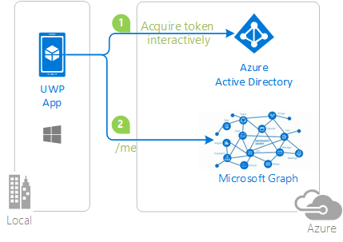

# Using MSAL.NET with UWP applications

>[!NOTE]
>Please see [WAM](./wam.md) for how to configure your UWP app to handle authentication through the Windows Broker.

## Legacy scenarios that do not use the broker / WAM

### UseCorporateNetwork

On UWP, <xref:Microsoft.Identity.Client.PublicClientApplication> has the following property `UseCorporateNetwork`. This is a boolean which enables the UWP application to benefit from Integrated Windows Authentication (and therefore SSO with the user signed-in with the operating system) if this user is signed-in with an account in a federated Azure AD tenant.

**Important:**
Setting this property to true assumes that the application developer has enabled Integrated Windows Authentication (IWA) in the application. For this:

- In the ``Package.appxmanifest`` for your UWP application, in the Capabilities tab, enable the following capabilities:
  - Enterprise Authentication
  - Private Networks (Client & Server)
  - Shared User Certificate

IWA is not enabled by default because applications requesting the Enterprise Authentication or Shared User Certificates capabilities require a higher level of verification to be accepted into the Windows Store, and not all developers may wish to perform the higher level of verification.

>[!NOTE]
>The underlying implementation on the UWP platform (WAB) does not work correctly in Enterprise scenarios where Conditional Access was enabled. The symptom is that the user tries to sign-in with Windows hello, and is proposed to choose a certificate, but the certificate for the pin is not found, or the user chooses it, but never get prompted for the Pin. A workaround is to use an alternative method (username/password + phone authentication), but the experience is not good. In the future MSAL will leverage WAM, which will solve the problem.

### Troubleshooting

Some customers have reported that in specific enterprise environments there was the following sign-in error:

```text
We can't connect to the service you need right now. Check your network connection or try this again later
```

Whereas they know they have an internet connection and the code works with a public network.

A workaround is to make sure that WAB (the underlying Windows component) allows private network access. You can do that by setting a registry key:

```text
HKEY_LOCAL_MACHINE\SOFTWARE\Microsoft\Windows NT\CurrentVersion\Image File Execution Options\authhost.exe\EnablePrivateNetwork = 00000001
```

For details see [Web authentication broker debugging with Fiddler](/windows/uwp/security/web-authentication-broker#fiddler).

## Sample illustrating UWP specific properties

More details are provided in the following samples:

Sample | Platform | Description
------ | -------- | -----------
[active-directory-dotnet-native-uwp-v2](https://github.com/azure-samples/active-directory-dotnet-native-uwp-v2) | UWP | A Windows Universal Platform client application using MSAL.NET, accessing the Microsoft Graph for a user authenticating with Azure AD v2.0 endpoint. 
[https://github.com/Azure-Samples/active-directory-xamarin-native-v2](https://github.com/Azure-Samples/active-directory-xamarin-native-v2) | Xamarin iOS, Android, UWP | A simple Xamarin Forms app showcasing how to use MSAL to authenticate MSA and Azure AD via the Azure AD v2.0 endpoint, and access the Microsoft Graph with the resulting token. 