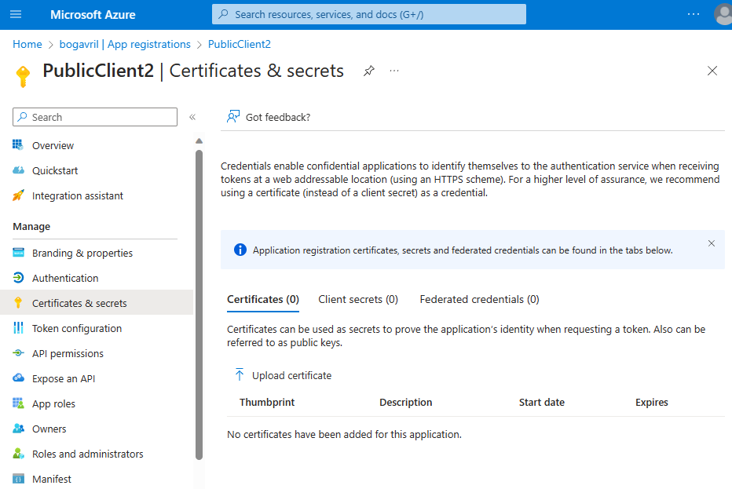
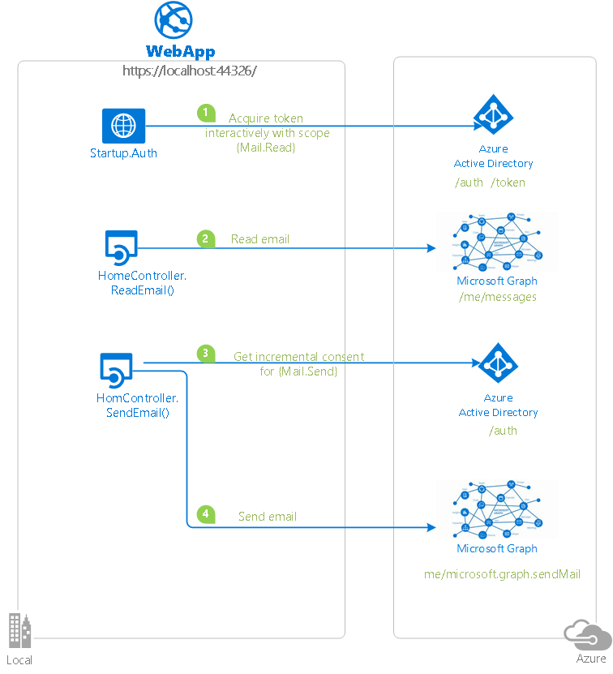

# Using MSAL.NET to get tokens by authorization code (for web sites)

When users login to Web applications (web sites) using Open Id connect, the web application receives an authorization code which it can redeem to acquire a token to call Web APIs. In ASP.NET / ASP.NET core web apps, the only goal of `AcquireTokenByAuthorizationCode` is to add a token to the token cache, so that it can then be used by the application (usually in the controllers) which just get a token for an API using `AcquireTokenSilent`.

## ASP.NET and ASP.NET Core: use Microsoft.Identity.Web

If you are building a web app on ASP.NET Core, the recommendation is to use [Microsoft.Identity.Web](https://github.com/AzureAD/microsoft-identity-web/wiki)

## Application registration

You need to register a Reply URI so that Azure AD gets the authorization code and the token back to your application.

You should also register your application secrets either through the interactive experience in the [Azure portal](https://portal.azure.com/#blade/Microsoft_AAD_IAM/ActiveDirectoryMenuBlade/RegisteredAppsPreview), or using command-line tools (like PowerShell)

### Registering client secrets using the application registration portal

The management of client credentials happens in the **certificates & secrets** page for an application:



- The application secret (also named client secret) is generated by Azure AD during the registration of the confidential client application when you select **New client secret**. At that point, you must copy the secret string in the clipboard for use in your app, before selecting **Save**. This string won't be presented any longer.
- The certificate is uploaded in the application registration using the **Upload certificate** button

#### Registering client secrets using PowerShell

The [active-directory-dotnetcore-daemon-v2](https://github.com/Azure-Samples/active-directory-dotnetcore-daemon-v2) sample shows how to register an application secret or a certificate with an Azure AD application:

- For details on how to register an application secret, see [AppCreationScripts/Configure.ps1](https://github.com/Azure-Samples/active-directory-dotnetcore-daemon-v2/blob/5199032b352a912e7cc0fce143f81664ba1a8c26/AppCreationScripts/Configure.ps1#L190)
- For details on how to register a certificate with the application, see [AppCreationScripts-withCert/Configure.ps1](https://github.com/Azure-Samples/active-directory-dotnetcore-daemon-v2/blob/5199032b352a912e7cc0fce143f81664ba1a8c26/AppCreationScripts-withCert/Configure.ps1#L162-L178)

### Construction of ConfidentialClientApplication with client credentials

This flow is only available in the confidential client flow; therefore the protected Web API provides client credentials (client secret or certificate) to the [ConfidentialClientApplicationBuilder](/dotnet/api/microsoft.identity.client.appconfig.confidentialclientapplicationbuilder?view=azure-dotnet-preview) via the or the `WithClientSecret` or `WithCertificate` methods respectively.


```csharp
IConfidentialClientApplication app;

#if !VariationWithCertificateCredentials
app = ConfidentialClientApplicationBuilder.Create(config.ClientId)
           .WithClientSecret(config.ClientSecret)
           .Build();
#else
// Building the client credentials from a certificate
X509Certificate2 certificate = ReadCertificate(config.CertificateName);
app = ConfidentialClientApplicationBuilder.Create(config.ClientId)
    .WithCertificate(certificate)
    .Build();
#endif
```

### Getting tokens by authorization code in MSAL.NET

To redeem an authorization code and get a token, and cache it, the `IConfidentialClientApplication` contains a method called `AcquireTokenByAuthorizationCode`:

```csharp
AcquireTokenByAuthorizationCode(
            IEnumerable<string> scopes,
            string authorizationCode)
```

This principle is illustrated below the code performing the application initialization located in the `Startup.cs` file, and, to add authentication with the Microsoft Identity platform (formerly Azure AD) v2.0, you'll need to add the following code  (The comments in the code should be self-explanatory):

```csharp
 services.AddAuthentication(AzureADDefaults.AuthenticationScheme)
         .AddAzureAD(options => configuration.Bind("AzureAd", options));

 services.Configure<OpenIdConnectOptions>(AzureADDefaults.OpenIdScheme, options =>
 {
  // The ASP.NET core templates are currently using Azure AD v1.0, and compute
  // the authority (as {Instance}/{TenantID}). We want to use the Microsoft Identity Platform v2.0 endpoint
  options.Authority = options.Authority + "/v2.0/";

  // Response type. We ask ASP.NET to request an Auth Code, and an IDToken
   options.ResponseType = OpenIdConnectResponseType.CodeIdToken;

  // The "offline_access" scope is needed to get a refresh token when users sign-in with
  // their Microsoft personal accounts
  // (it's required by MSAL.NET and automatically provided by Azure AD when users
  // sign-in with work or school accounts, but not with their Microsoft personal accounts)
  options.Scope.Add(OidcConstants.ScopeOfflineAccess);
  options.Scope.Add("user.read"); // for instance
 
  // If you want to restrict the users that can sign-in to specific organizations
  // Set the tenant value in the appsettings.json file to 'organizations', and add the
  // issuers you want to accept to options.TokenValidationParameters.ValidIssuers collection.
  // Otherwise validate the issuer
  options.TokenValidationParameters.IssuerValidator = 
         AadIssuerValidator.ForAadInstance(options.Authority).ValidateAadIssuer;

  // Set the nameClaimType to be preferred_username.
  // This change is needed because certain token claims from Azure AD v1.0 endpoint
  // (on which the original .NET core template is based) are different in Azure AD v2.0 endpoint. 
  // For more details see [ID Tokens](/azure/active-directory/develop/id-tokens) 
  // and [Access Tokens](/azure/active-directory/develop/access-tokens)
  options.TokenValidationParameters.NameClaimType = "preferred_username";

  // Handling the auth redemption by MSAL.NET so that a token is available in the token cache
  // where it will be usable from Controllers later (through the TokenAcquisition service)
  var handler = options.Events.OnAuthorizationCodeReceived;
  options.Events.OnAuthorizationCodeReceived = async context =>
  {
   // As AcquireTokenByAuthorizationCode is asynchronous we want to tell ASP.NET core
   // that we are handing the code even if it's not done yet, so that it does 
   // not concurrently call the Token endpoint.
   context.HandleCodeRedemption();

    // Call MSAL.NET AcquireTokenByAuthorizationCode
    var application = BuildConfidentialClientApplication(context.HttpContext,
                                                         context.Principal);
    var result = await application.AcquireTokenByAuthorizationCode(scopes.Except(scopesRequestedByMsalNet),
                                                                   context.ProtocolMessage.Code)
                                  .ExecuteAsync();

    // Do not share the access token with ASP.NET Core otherwise ASP.NET will cache it
    // and will not send the OAuth 2.0 request in case a further call to
    // AcquireTokenByAuthorizationCode in the future for incremental consent 
    // (getting a code requesting more scopes)
    // Share the ID Token so that the identity of the user is known in the application (in 
    // HttpContext.User)
    context.HandleCodeRedemption(null, result.IdToken);

    // Call the previous handler if any
    await handler(context);
   };
```

In ASP.NET Core, building the confidential client application leverages information that is in the `HttpContext`, which, in particular contains the URL for the Web site, which helps building the `RedirectUri`.

```csharp
/// <summary>
/// Creates an MSAL Confidential client application
/// </summary>
/// <param name="httpContext">HttpContext associated with the OIDC response</param>
/// <param name="claimsPrincipal">Identity for the signed-in user</param>
/// <returns></returns>
private IConfidentialClientApplication BuildConfidentialClientApplication(HttpContext httpContext, ClaimsPrincipal claimsPrincipal)
{
 var request = httpContext.Request;

 // Find the URI of the application)
 string currentUri = UriHelper.BuildAbsolute(request.Scheme, request.Host, request.PathBase, azureAdOptions.CallbackPath ?? string.Empty);

 // Updates the authority from the instance (including national clouds) and the tenant
 string authority = $"{azureAdOptions.Instance}{azureAdOptions.TenantId}/";

 // Instantiates the application based on the application options (including the client secret)
 var app = ConfidentialClientApplicationBuilder.CreateWithApplicationOptions(_applicationOptions)
               .WithRedirectUri(currentUri)
               .WithAuthority(authority)
               .Build();

 // Initialize token cache providers. In the case of Web applications, there must be one
 // token cache per user. 
 // Here the key of the token cache is in the claimsPrincipal
 // which contains the identity of the signed-in user,
 if (this.UserTokenCacheProvider != null)
 {
  this.UserTokenCacheProvider.Initialize(app.UserTokenCache, httpContext, claimsPrincipal);
 }
 if (this.AppTokenCacheProvider != null)
 {
  this.AppTokenCacheProvider.Initialize(app.AppTokenCache, httpContext);
 }
 return app;
}
```

The web app should also implement token cache serialization. This is explained in [Token cache serialization in MSAL.NET](/azure/active-directory/develop/msal-net-token-cache-serialization).

#### Guest users

A guest user in a tenant is a user account that was not originally created in that tenant, but in some other tenant. When acquiring tokens in MSAL, in order for home account ID to show the correct home tenant of the user, certain set up has to be done in ASP.NET Core and ASP.NET OWIN. Microsoft.Identity.Web simplifies logging in guest users for both of those platforms. See [OWIN sample app](https://github.com/AzureAD/microsoft-identity-web/tree/master/tests/DevApps/aspnet-mvc) for details.

### Troubleshooting

- The code is usable only **once** to redeem a token. `AcquireTokenByAuthorizationCode` should not be called several times with the same authorization code (it's explicitly prohibited by the protocol standard spec). If you redeem the code several times, consciously, or because you are not aware that a framework also does it for you, you'll get an error:
   `'invalid_grant', 'AADSTS70002: Error validating credentials. AADSTS54005: OAuth2 Authorization code was already redeemed, please retry with a new valid code or use an existing refresh token`

- In particular, if you are writing an ASP.NET / ASP.NET Core application, this might happen if you don't tell the ASP.NET/Core framework that you have already redeemed the code. For this you need to call `context.HandleCodeRedemption()` part of the `AuthorizationCodeReceived` event handler.

- Finally, avoid sharing the access token with ASP.NET otherwise this might prevent incremental consent happening correctly, (for details see issue #[693](https://github.com/AzureAD/microsoft-authentication-library-for-dotnet/issues/693)).

This very operation will add a token to the token cache, and therefore the controllers that need a token later will be able to acquire a token silently, as does the SendMail() method of the [HomeController.cs#L55-L76](https://github.com/Azure-Samples/active-directory-dotnet-webapp-openidconnect-v2/blob/c2087374e849fd58b5bf75ffebef1ac0e106884d/WebApp/Controllers/HomeController.cs#L56-L76)

### Protocol documentation

For details about the protocol, see [v2.0 Protocols - OAuth 2.0 authorization code flow](/azure/active-directory/develop/v2-oauth2-auth-code-flow)

### Interesting samples using the authorization code flow

Sample | Description
------ | ------------
active-directory-aspnetcore-webapp-openidconnect-v2 in branch [aspnetcore2-2-signInAndCallGraph](https://github.com/Azure-Samples/active-directory-aspnetcore-webapp-openidconnect-v2/tree/aspnetcore2-2-signInAndCallGraph) | Web application that handles sign on via the (Azure AD V2) unified Azure AD and MSA endpoint, so that users can sign in using both their work/school account or Microsoft account. The sample also shows how to use MSAL to obtain a token for invoking the Microsoft Graph, including how to handle incremental consent. 
[active-directory-dotnet-webapp-openidconnect-v2](https://github.com/Azure-Samples/active-directory-dotnet-webapp-openidconnect-v2) | Web application that handles sign on via the (Azure AD V2) unified Azure AD and MSA endpoint, so that users can sign in using both their work/school account or Microsoft account. The sample also shows how to use MSAL to obtain a token for invoking the Microsoft Graph. 
[active-directory-dotnet-admin-restricted-scopes-v2](https://github.com/azure-samples/active-directory-dotnet-admin-restricted-scopes-v2) | An ASP.NET MVC application that shows how to use the Azure AD v2.0 endpoint to collect consent for permissions that require administrative consent. 

See [Acquiring tokens with authorization codes on web apps](./authorization-codes.md).
