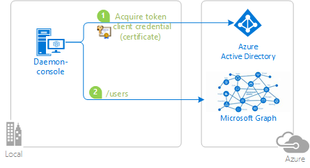
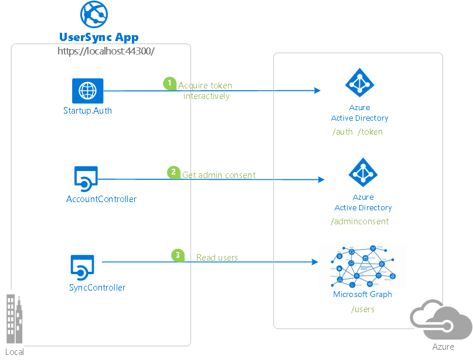

# Client credential flows

## Availability by platform

MSAL is a multi-framework library. Confidential Client flows are not available on mobile and client-facing platforms (e.g., UWP, Xamarin.iOS, and Xamarin.Android) since there is no secure way of deploying a secret with an application.

## Using client credentials

MSAL.NET supports two types of client credentials, which must be registered in the Microsoft Entra portal:

- Application secrets (_not recommended for production scenarios_).
- Certificates.

For advanced scenarios, two other types credentials can be used:

- Signed client assertions.
- Certificate and additional claims to be sent.

For additional details, refer to the [Confidential client assertions](/azure/active-directory/develop/msal-net-client-assertions) document.

### Example usage

```csharp
// this object will cache tokens in-memory - keep it as a singleton
var singletonApp = ConfidentialClientApplicationBuilder.Create(config.ClientId)
           // don't specify authority here, we'll do it on the request 
        .WithCertificate(certificate) // or .WithSecret(secret)
        .Build();

// If instead you need to re-create the ConfidentialClientApplication on each request, you MUST customize 
// the cache serialization (see below)

// when making the request, specify the tenanted authority
var authResult = await app.AcquireTokenForClient(scopes: new [] {  "some_app_id_uri/.default"})        // uses the token cache automatically, which is optimized for multi-tenant access
        .WithAuthority(AzureCloudInstance.AzurePublic, "{tenantID}")  // do not use "common" or "organizations"!
        .ExecuteAsync();
```

>[!IMPORTANT]
>Do not use `common` or `organizations` authority for client credential flows.

## Custom cache serialization

If your service is multi-tenant (i.e., it needs tokens for a resource that is in a different tenant), see [MSAL for client credential flow in multi-tenant services](../../advanced/client-credential-multi-tenant.md).

You can serialize the token cache to a location of your choice (e.g., in-memory or through a distributed system like Redis). You would do this to:

- Share the token cache between several instances of [`ConfidentialClientApplication`](xref:Microsoft.Identity.Client.ConfidentialClientApplication).
- Persist the token cache to share it between different machines.

Please see [distributed cache implementations](https://github.com/AzureAD/microsoft-identity-web/tree/master/src/Microsoft.Identity.Web.TokenCache/Distributed) and [binding the token cache](/azure/active-directory/develop/msal-net-token-cache-serialization) for additional implementation details.

Check our [sample](https://github.com/Azure-Samples/active-directory-dotnet-v1-to-v2/blob/b48c10180665260a1aec78a9acf7d1b1ff97e5ba/ConfidentialClientTokenCache/Program.cs) to see how token cache serialization works.

## Ensuring high availability of your applications

### Service is running out of memory

See [MSAL for client credential flow in multi-tenant services](../../advanced/client-credential-multi-tenant.md).
Provision enough RAM on the machines running your service or use a distributed cache.
A single token is a only a few KB in size, but there is 1 token for each tenant! A multi-tenant service sometimes needs tokens for 0.5M tenants.

### Avoid requesting new tokens on each machine of a distributed service

Use a distributed cache like Redis.

### Monitoring cache hit rates

The result object will tell you if the token comes from the cache or not:

```csharp
authResult.AuthenticationResultMetadata.TokenSource == TokenSource.Cache
```

### Handling "loop detected" errors

You are calling Microsoft Entra ID for a token to often and Azure ADis throttling you. You need to use a cache - either the in-memory one (as per the sample above) or a persisted one.

### High latency for token acquisition

Please ensure you have a high token cache hit rate.

The in-memory cache is optimized for searching through tokens that come from different client_id or different tenant_id. It is not optimized for storing tokens with different scopes. You need to use a different cache key that includes the scope. See [Performance testing](../../advanced/performance-testing.md).

<a name='registration-of-application-secret-or-certificate-with-azure-ad'></a>

## Registration of application secret or certificate with Microsoft Entra ID

You can register your application secrets either through the interactive experience in the [Azure portal](https://portal.azure.com/#blade/Microsoft_AAD_IAM/ActiveDirectoryMenuBlade/RegisteredAppsPreview), or using command-line tools (like PowerShell)

### Registering client secrets using the application registration portal

The management of client credentials happens in the **certificates & secrets** page for an application:


### Registering client secrets using PowerShell

The [active-directory-dotnetcore-daemon-v2](https://github.com/Azure-Samples/active-directory-dotnetcore-daemon-v2) sample shows how to register an application secret or a certificate with a Microsoft Entra application:

- For details on how to register an application secret, see [AppCreationScripts/Configure.ps1](https://github.com/Azure-Samples/active-directory-dotnetcore-daemon-v2/blob/5199032b352a912e7cc0fce143f81664ba1a8c26/AppCreationScripts/Configure.ps1#L190)
- For details on how to register a certificate with the application, see [AppCreationScripts-withCert/Configure.ps1](https://github.com/Azure-Samples/active-directory-dotnetcore-daemon-v2/blob/5199032b352a912e7cc0fce143f81664ba1a8c26/AppCreationScripts-withCert/Configure.ps1#L162-L178)

## Construction of ConfidentialClientApplication with client credentials

In MSAL.NET client credentials are passed as a parameter at the application construction

Then, once the confidential client application is constructed, acquiring the token is a question of calling overrides of ``AcquireTokenForClient``, passing the scope, and forcing or not a refresh of the token.

## Client assertions

Instead of a client secret or a certificate, the confidential client application can also prove its identity using client assertions. This advanced scenario is detailed in [Confidential client assertions](/azure/active-directory/develop/msal-net-client-assertions).

## Remarks

### AcquireTokenForClient uses the application token cache

`AcquireTokenForClient` uses the **application token cache** (not the user token cache)
Don't call `AcquireTokenSilent` before calling `AcquireTokenForClient` as `AcquireTokenSilent` uses the **user** token cache. `AcquireTokenForClient` checks the **application** token cache itself and updates it.

### Scopes to request

The scope to request for a client credential flow is the name of the resource followed by `/.default`. This notation tells Microsoft Entra ID to use the **application level permissions** declared statically during the application registration. Also these API permissions must be granted by a tenant administrator

```csharp
ResourceId = "someAppIDURI";
var scopes = new [] {  ResourceId+"/.default"};

var result = app.AcquireTokenForClient(scopes);
```

### No need to pass a Reply URL at app construction if your app is only a daemon

In the case where your confidential client application uses **only** client credentials flow, you don't need to pass a reply URL passed in the constructor.

## Samples illustrating acquiring tokens interactively with MSAL.NET

Sample | Platform | Description
------ | -------- | -----------
[active-directory-dotnetcore-daemon-v2](https://github.com/Azure-Samples/active-directory-dotnetcore-daemon-v2) | .NET Core 2.1 Console | <p>A simple .NET Core application that displays the users of a tenant querying the Microsoft Graph using the identity of the application, instead of on behalf of a user.</p>  <p>The sample also illustrates the variation with certificates.</p> 
[active-directory-dotnet-daemon-v2](https://github.com/Azure-Samples/active-directory-dotnet-daemon-v2) | ASP.NET MVC | <p>A web application that sync's data from the Microsoft Graph using the identity of the application, instead of on behalf of a user.</p>

## More info

You can find more information in:

- The protocol documentation: [Azure Active Directory v2.0 and the OAuth 2.0 client credentials flow](/azure/active-directory/develop/v2-oauth2-client-creds-grant-flow)

See [Client credentials in MSAL.NET](./client-credential-flows.md).
